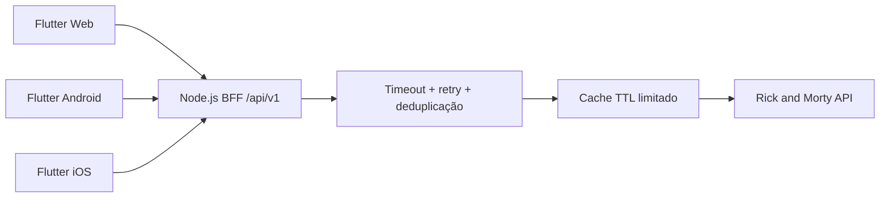
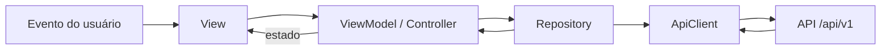
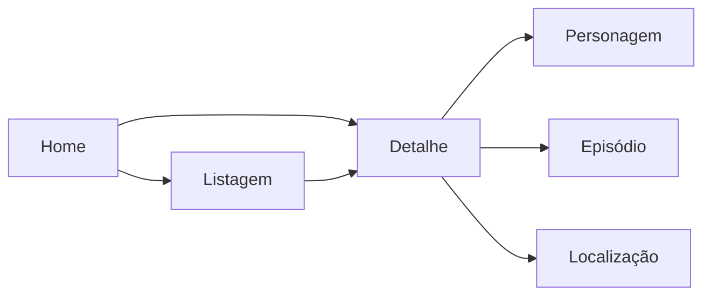

# Arquitetura e decisões técnicas

## Visão geral

O repositório separa o backend do cliente multiplataforma. Flutter nunca acessa
diretamente a API pública de Rick and Morty: todas as plataformas usam o mesmo
contrato intermediário em `/api/v1`.



Essa divisão mantém filtros, mapeamentos, ordenação, relacionamentos e tratamento
de falhas fora da interface. O contrato HTTP está documentado em
[`API.md`](API.md) e formalizado em [`openapi.yaml`](openapi.yaml).

## Backend

A API usa arquitetura limpa modular. Express aparece apenas na borda HTTP; regras
de negócio não dependem do framework nem dos DTOs da API externa.

```text
apps/api/src/
|-- modules/
|   |-- characters/
|   |   |-- domain/          # modelos e regras puras
|   |   |-- application/     # casos de uso e portas de saída
|   |   `-- presentation/    # controllers e routers Express
|   |-- episodes/
|   `-- locations/
|-- infrastructure/
|   |-- rick-and-morty/      # cliente HTTP, DTOs e mappers externos
|   `-- cache/               # cache usado pelo adaptador
|-- presentation/http/       # router raiz, parsers e middlewares
|-- shared/                  # erros e utilitários assíncronos
|-- config/                  # leitura e validação do ambiente
|-- app.ts                   # composição da aplicação
`-- main.ts                  # bootstrap do processo
```

As dependências apontam para dentro:

```text
presentation -> application -> domain
infrastructure -> interfaces de application
```

Isso permite testar os casos de uso com fakes, sem Express ou chamadas reais. Os
routers de cada módulo são reunidos em `presentation/http/api.routes.ts`.

### Detalhes e relacionamentos

O fluxo de detalhe de episódio exemplifica a separação:

1. O controller valida ID e parâmetros de ordenação.
2. O gateway consulta o episódio e converte URLs externas em IDs.
3. O caso de uso solicita os personagens em batch.
4. O mapper produz o contrato público da aplicação.
5. O domínio ordena os personagens antes da resposta.

O mesmo comparador, baseado em `Intl.Collator("pt-BR")`, é reutilizado em
episódios, residentes e `/characters/all`. O ID funciona como desempate, tornando
o resultado determinístico mesmo quando nomes são equivalentes.

Endpoints `/batch` evitam N+1 ao expandir relacionamentos. Endpoints `/all`
carregam a primeira página e processam as demais com no máximo quatro chamadas
concorrentes.

### Resiliência upstream

O cliente externo:

- usa timeout por requisição;
- repete falhas de transporte e status `429`, `502`, `503` e `504` por até três
  tentativas;
- respeita `Retry-After` ou aplica backoff exponencial com jitter;
- deduplica chamadas idênticas que estejam em andamento;
- mantém cache TTL com limite padrão de 500 entradas;
- transforma `404` de uma listagem filtrada em página vazia `200`;
- preserva `404` para detalhes inexistentes.

## Flutter Web, Android e iOS

O cliente adota MVVM orientado por feature, seguindo os guias oficiais do
Flutter. Web, Android e iOS compartilham domínio, repositories, controllers e a
maior parte dos componentes; apenas as composições que realmente diferem por
plataforma ficam em widgets específicos.



As camadas usadas são:

- **UI:** Views, Pages, widgets e ViewModels/Controllers;
- **Data:** repositories e transporte HTTP;
- **Domain:** modelos e regras reutilizáveis ou com complexidade própria.

Use cases não são criados apenas para repassar uma chamada. Eles só se tornam
necessários quando uma regra combinar repositories ou justificar reutilização.
Essa escolha preserva limites claros sem criar boilerplate para o tamanho atual.

### Estrutura

```text
apps/mobile/lib/
|-- main.dart
`-- src/
    |-- app/
    |   |-- app.dart                 # MaterialApp e composição raiz
    |   |-- app_config.dart          # configuração de ambiente
    |   |-- navigation/              # shell, headers, busca e filtros
    |   `-- theme/                   # cores e ThemeData
    |-- core/
    |   |-- errors/
    |   |-- network/
    |   `-- ui/
    `-- features/
        |-- characters/
        |-- episodes/
        |-- home/
        `-- locations/
            |-- data/
            |-- domain/
            `-- presentation/
```

O código é organizado primeiro por feature. Algo só vai para `core` quando for
infraestrutura global ou for compartilhado por mais de uma feature.

### Estado, dependências e navegação

- `ChangeNotifier`, `ListenableBuilder` e `AnimatedBuilder` formam o mecanismo de
  estado, sem dependência adicional.
- Repositories e controllers são injetados manualmente por construtor no
  composition root.
- Views renderizam estado e encaminham eventos; não executam HTTP nem convertem
  DTOs.
- O fluxo é unidirecional e as coleções expostas são imutáveis.
- `Navigator` e `MaterialPageRoute` atendem o fluxo atual. Um router declarativo
  só se justificaria com deep links ou rotas Web nomeadas.
- O shell usa cabeçalho e navegação próprios para Web/mobile, mantendo a mesma
  lógica de dados.



### Paginação e concorrência na interface

- As três seções da Home possuem paginação independente.
- A listagem geral de personagens usa infinite load vertical.
- Episódios e localizações gerais usam `/all` para filtro e ordenação locais.
- A pesquisa remota de personagens aguarda 350 ms.
- Cada pesquisa incrementa uma geração; respostas antigas são ignoradas.
- Uma falha na página seguinte mantém os itens e oferece nova tentativa.
- A lista infinita ordena o conjunto carregado; `/characters/all` é globalmente
  ordenado pelo backend.

## Decisões e trade-offs

| Decisão | Motivo | Consequência |
| --- | --- | --- |
| Flutter para Web/iOS/Android | Entregar os três targets com consistência no prazo | Uma base compartilhada, com layouts específicos quando necessário |
| BFF Node.js + TypeScript | Isolar os clientes do contrato e limites externos | Contrato estável, erros normalizados, cache, retry e ordenação centralizados |
| MVVM por feature | Manter responsabilidades testáveis sem abstrações excessivas | Controllers e repositories simples, com injeção manual |
| `node:test` em vez de Jest | Node 24 já fornece runner e cobertura | Menos dependências sem perda dos cenários necessários |
| `/batch`, `/all` e paginação | Evitar N+1 e equilibrar completude com custo inicial | Cada tela escolhe o modelo de carregamento adequado |
| Cache em memória | Reduzir chamadas repetidas sem infraestrutura extra | Cache local ao processo, suficiente para o desafio, não distribuído |
| Remoção de favoritos | Persistência e sincronização não eram centrais à avaliação | Mais tempo dedicado à arquitetura, testes e resiliência |
| Sem cliente React | Flutter já atende o target Web solicitado | Nenhuma segunda base de UI para manter |
| CI sem CD | Não existe ambiente nem credenciais de publicação | Pipeline valida e gera artefatos, mas não promete deploy |

## Convenções principais

- arquivos e diretórios usam `snake_case`; tipos usam `UpperCamelCase`;
- modelos são imutáveis e estados representam loading, sucesso, vazio e falha;
- dependências são explícitas e não existe service locator global;
- exceções de transporte são normalizadas antes de chegar à UI;
- correções de comportamento devem incluir um teste de regressão;
- testes automatizados não dependem da API pública real.

A estratégia e os comandos de validação estão em [`TESTING.md`](TESTING.md).

## Referências

- [Flutter architectural overview](https://docs.flutter.dev/resources/architectural-overview)
- [Architecting Flutter apps](https://docs.flutter.dev/app-architecture)
- [Common architecture concepts](https://docs.flutter.dev/app-architecture/concepts)
- [Guide to app architecture](https://docs.flutter.dev/app-architecture/guide)
- [Rick and Morty API](https://rickandmortyapi.com/documentation)
