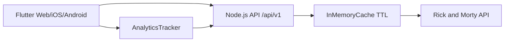

# Arquitetura

## Visao geral

## Backend

A API foi organizada por responsabilidade:

- `config`: leitura de variaveis de ambiente.
- `integrations/rick-and-morty`: cliente HTTP e tipos da API externa.
- `features/episodes`: regra de negocio, mappers e ordenacao.
- `features/analytics`: tracking simples e substituivel.
- `http`: controllers, rotas e parsers.
- `shared`: cache, middlewares e tratamento de erros.

O fluxo de detalhes de episodio faz:

1. Busca o episodio por id.
2. Extrai ids das URLs de personagens.
3. Busca os personagens em lote com `/character/1,2,3`.
4. Mapeia para DTO proprio.
5. Ordena os personagens antes de responder ao cliente.

## Flutter

O app segue separacao por feature:

- `domain`: modelos e enums.
- `data`: repository remoto.
- `presentation`: controllers e paginas.
- `core/network`: cliente HTTP.
- `features/analytics`: contrato e implementacao de tracking.

O estado usa `ChangeNotifier` para manter o projeto leve, sem acoplar uma biblioteca de estado onde o escopo ainda nao justifica.
