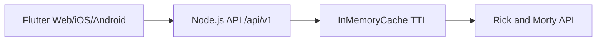

# Arquitetura

## Visao geral



## Backend

A API usa arquitetura limpa modular. MVC aparece apenas na borda HTTP; regras de
negocio nao dependem de Express nem dos contratos da API externa.

```text
src/
|-- modules/
|   |-- characters/
|   |   |-- domain/          # modelos e regras puras
|   |   |-- application/     # casos de uso e portas de saida
|   |   `-- presentation/    # controller e router Express
|   `-- episodes/
|-- infrastructure/
|   |-- rick-and-morty/      # adaptador HTTP, DTOs e mappers externos
|   `-- cache/               # cache usado pelo adaptador
|-- presentation/http/       # router raiz, parsers e middlewares HTTP
|-- shared/                  # erros sem dependencia de framework
|-- config/                  # leitura e validacao do ambiente
|-- app.ts                   # composicao da aplicacao Express
`-- main.ts                  # bootstrap do processo
```

As dependencias apontam para dentro: `presentation -> application -> domain`.
Infraestrutura implementa as interfaces declaradas em `application`; por isso os
casos de uso podem ser testados com doubles e nao conhecem DTOs da Rick and Morty API.
`app.ts` e os routers conectam essas implementacoes.

As rotas consumidas pelo Flutter sao montadas em
`presentation/http/api.routes.ts`, sob `/api/v1`. Cada modulo declara suas rotas
em `modules/<feature>/presentation/*.routes.ts`.

O fluxo de detalhes de episodio faz:

1. Busca o episodio por id.
2. O adaptador externo extrai os ids das URLs e entrega um modelo de dominio.
3. O caso de uso busca os personagens em lote pela porta de aplicacao.
4. O adaptador mapeia os DTOs externos para contratos proprios.
5. Ordena os personagens antes de responder ao cliente.

## Flutter

O app segue separacao por feature:

- `domain`: modelos e enums.
- `data`: repository remoto.
- `presentation`: controllers e paginas.
- `core/network`: cliente HTTP.

O estado usa `ChangeNotifier` para manter o projeto leve, sem acoplar uma biblioteca de estado onde o escopo ainda nao justifica.
