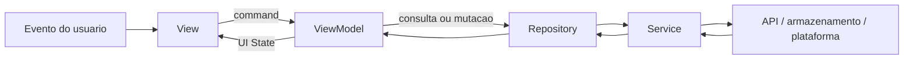

# Arquitetura Flutter

## Decisao

O cliente Web, Android e iOS adota **MVVM orientado por feature**, seguindo o guia
oficial de arquitetura de aplicativos Flutter.

As duas camadas obrigatorias sao:

- **UI:** Views e ViewModels.
- **Data:** Repositories e Services.

A camada **Domain** e opcional. Ela recebe use cases apenas quando a regra:

- combina dados de mais de um repository;
- tem complexidade relevante; ou
- e reutilizada por mais de um ViewModel.

Nao criamos use cases que apenas repassam uma chamada. Essa decisao preserva os
limites arquiteturais sem produzir boilerplate para um aplicativo ainda pequeno.

## Principios

1. **Separacao de responsabilidades:** widgets renderizam estado; regras de dados
   ficam fora da arvore de widgets.
2. **Fonte unica de verdade:** cada tipo de dado e controlado pelo seu repository.
3. **Fluxo unidirecional:** eventos saem da View em direcao ao ViewModel e aos
   dados; estado volta para a View.
4. **UI declarativa:** a interface e uma funcao de estado imutavel.
5. **Dependencias explicitas:** objetos recebem suas dependencias pelo construtor.
6. **Dependencias apontam para baixo:** UI pode depender de Domain e Data; Domain
   pode depender de abstracoes de Data; Data nunca depende de UI.
7. **Arquitetura incremental:** uma abstracao e adicionada quando resolve uma
   necessidade concreta, nao apenas para completar uma camada.

## Fluxo



Use cases opcionais ficam entre ViewModel e Repository.

## Responsabilidades

### View

- Compoe widgets e renderiza o estado exposto pelo ViewModel.
- Encaminha gestos e entradas para commands do ViewModel.
- Pode conter apenas logica de layout responsivo, animacao, navegacao simples e
  exibicao condicional.
- Nao chama HTTP, nao converte DTOs e nao implementa regra de negocio.
- Um `build` nao produz efeitos colaterais.

### ViewModel

- Mantem o estado necessario para uma View.
- Carrega e transforma modelos da aplicacao em estado adequado para a UI.
- Expoe commands para as interacoes da View.
- Nao importa widgets nem recebe `BuildContext`.
- Nao realiza navegacao diretamente; comunica resultados para a View quando
  necessario.

Neste projeto, ViewModels estendem `ChangeNotifier`. O estado publico deve ser
somente leitura. Mutacoes ocorrem apenas por commands do proprio ViewModel.

### Repository

- E a fonte unica de verdade para um tipo de dado.
- Converte dados dos services em modelos usados pelo aplicativo.
- Centraliza cache, refresh, retry e normalizacao de erros quando aplicavel.
- Nao depende de outro repository. Combinacoes pertencem ao ViewModel ou a um use
  case.

### Service

- Encapsula uma fonte externa: API REST, armazenamento local ou plugin de
  plataforma.
- E stateless e expoe operacoes assincronas.
- Trabalha com DTOs ou respostas brutas da fonte.
- Nao contem estado de UI nem regra de apresentacao.

### Use case

- Encapsula uma regra complexa ou reutilizavel.
- Depende de um ou mais repositories.
- Possui entradas e saidas explicitas e nao conhece Flutter UI.

## Estrutura de diretorios

```text
lib/
|-- main.dart
`-- src/
    |-- app/
    |   |-- app.dart                 # MaterialApp e composicao raiz
    |   |-- app_config.dart          # configuracao de ambiente
    |   |-- routing/                 # rotas quando houver mais de um fluxo
    |   `-- theme/                   # tokens e ThemeData
    |-- core/
    |   |-- errors/                  # falhas compartilhadas
    |   |-- network/                 # transporte HTTP compartilhado
    |   `-- ui/                      # widgets realmente globais
    `-- features/
        `-- episodes/
            |-- data/
            |   |-- models/          # DTOs, se necessarios
            |   |-- repositories/
            |   `-- services/
            |-- domain/              # opcional: modelos e use cases
            `-- ui/
                |-- views/
                |-- view_models/
                `-- widgets/
```

Organizamos primeiro por feature para que personagens, episodios, localizacoes e
favoritos evoluam de forma independente. Codigo vai para `core` somente quando for
compartilhado por pelo menos duas features ou quando representar infraestrutura
global.

## Convencoes

- Arquivos e diretorios usam `snake_case`; tipos usam `UpperCamelCase`.
- Views terminam em `_page.dart` ou `_view.dart`.
- ViewModels terminam em `_view_model.dart`.
- Repositories terminam em `_repository.dart`; services, em `_service.dart`.
- Modelos sao imutaveis. Colecoes expostas nao podem permitir mutacao externa.
- Estados de tela devem representar explicitamente `initial`, `loading`, `success`,
  `empty` e `failure` quando esses estados forem possiveis.
- Excecoes de transporte nao atravessam a camada de dados sem normalizacao.
- Imports entre features devem passar por contratos publicos; widgets internos nao
  sao reutilizados por caminho profundo.
- Widgets pequenos e privados podem permanecer no arquivo da View. Widgets
  reutilizados ou extensos vao para `ui/widgets`.

## Estado e injecao de dependencias

`ChangeNotifier` e `ListenableBuilder` ou `AnimatedBuilder` sao o padrao inicial.
Essa escolha usa recursos do SDK, e suficiente para o escopo atual e mantem os
ViewModels testaveis sem Flutter bindings.

A injecao e manual, por construtor, no composition root (`main.dart`/`app.dart`).
Nao usamos service locator global. Um container de DI ou outra solucao de estado so
sera adotado se a composicao ou o compartilhamento de estado se tornar
materialmente dificil; a mudanca exige uma nova decisao documentada.

## Navegacao

- A View inicia navegacao como resposta a uma interacao ou resultado do ViewModel.
- Argumentos de rota usam modelos ou identificadores tipados, nunca mapas soltos.
- Enquanto o fluxo for pequeno, `Navigator` e `MaterialPageRoute` sao suficientes.
- Um router declarativo sera avaliado quando deep links, redirecionamentos ou rotas
  Web nomeadas se tornarem requisitos.

## Layout multiplataforma

- O mesmo dominio, repositories e ViewModels sao compartilhados entre Web, Android
  e iOS.
- Views respondem a constraints, nao a uma lista de modelos de aparelho.
- `LayoutBuilder` e o mecanismo preferido para decidir composicao responsiva.
- Breakpoints pertencem ao design system e nao devem ser espalhados pelas Views.
- Diferencas de plataforma so existem quando melhoram comportamento nativo,
  acessibilidade ou entrada; nao duplicamos features inteiras por plataforma.

## Testes

- **Service:** parsing, status HTTP e integracao com o transporte usando doubles.
- **Repository:** mapeamento, cache, refresh e normalizacao de erros.
- **Use case:** regras puras e combinacao de repositories.
- **ViewModel:** transicoes completas de estado e commands com repositories fake.
- **Widget:** estados relevantes, interacoes, navegacao e layout nos breakpoints.
- **Golden:** componentes visuais estaveis e telas principais, quando o design
  system estiver implementado.
- **Integracao:** apenas jornadas criticas ponta a ponta.

Para cada comportamento corrigido, deve existir um teste que falharia antes da
correcao. Testes nao acessam a API publica real.

## Migracao do codigo atual

A evolucao sera incremental, mantendo o aplicativo executavel:

1. `EpisodesController` passa a `EpisodesViewModel`.
2. `presentation/` passa a `ui/`, separado em `views`, `view_models` e `widgets`.
3. `ApiClient` torna-se o service HTTP compartilhado ou passa a ser usado por
   services especificos de cada fonte.
4. `EpisodeRepository` permanece como fonte unica de verdade, mas separa DTOs dos
   modelos da aplicacao quando os contratos crescerem.
5. A pasta `domain` permanece apenas para modelos e regras que atendam aos criterios
   desta decisao.

Nao e necessario interromper o desenvolvimento para executar toda a migracao. Cada
feature nova ja deve nascer no formato definido aqui; arquivos existentes migram
quando forem alterados.

## Referencias

- [Flutter architectural overview](https://docs.flutter.dev/resources/architectural-overview)
- [Architecting Flutter apps](https://docs.flutter.dev/app-architecture)
- [Common architecture concepts](https://docs.flutter.dev/app-architecture/concepts)
- [Guide to app architecture](https://docs.flutter.dev/app-architecture/guide)
